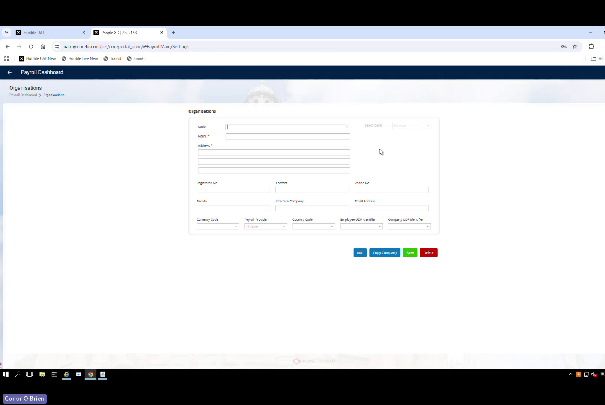
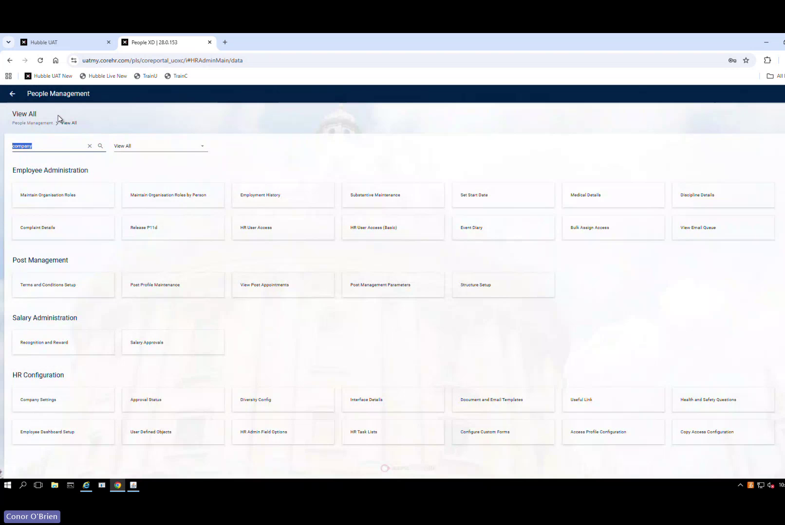
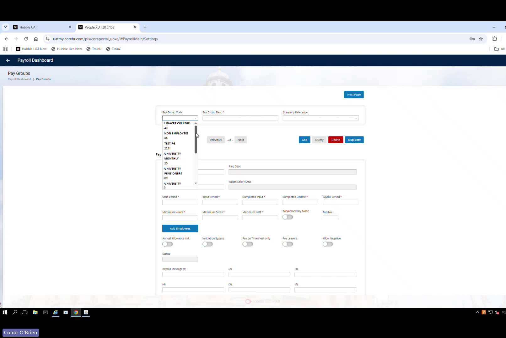
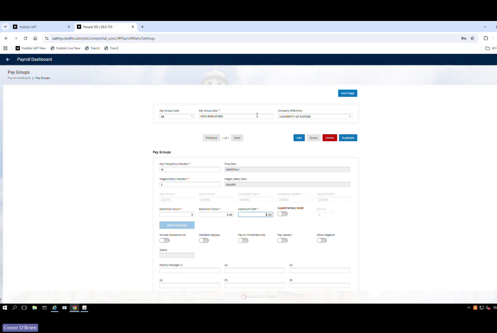
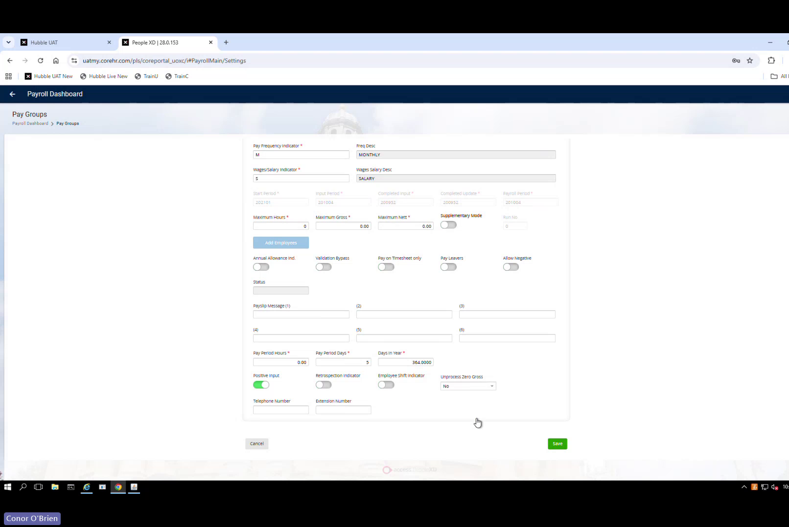
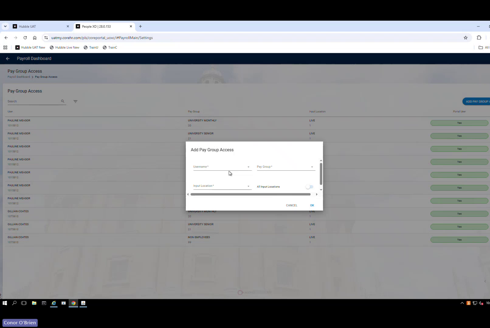
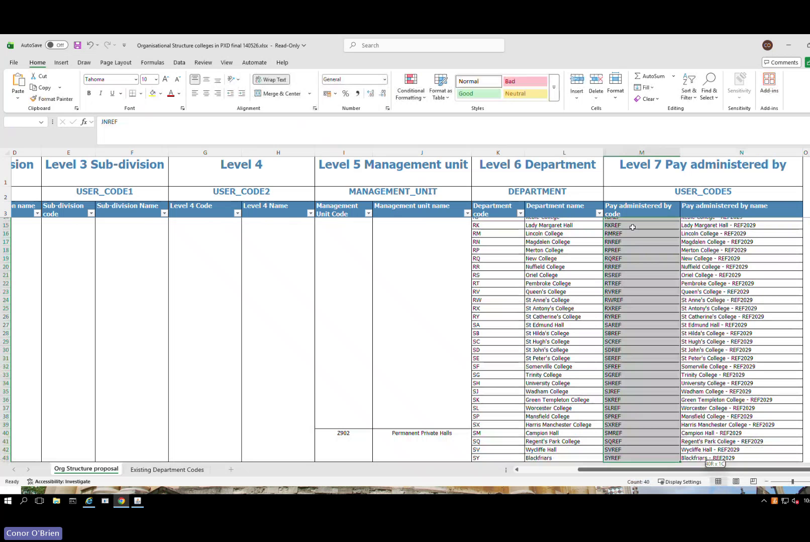
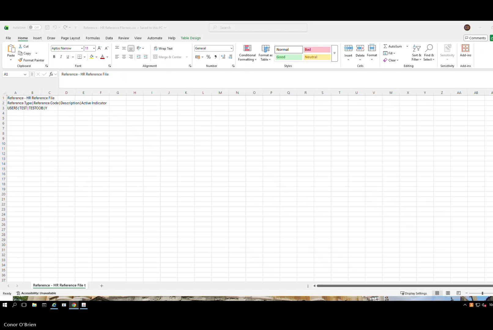
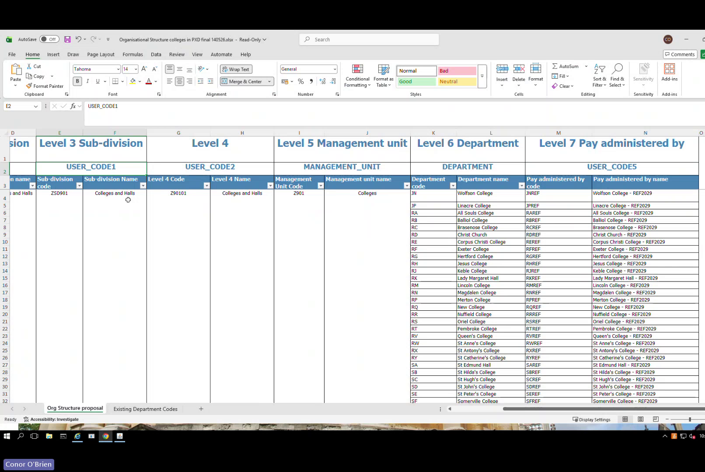

# HOW TO: Create a Non-Payroll Company & Link the Hierarchy
## Colleges & Halls — Avanti UOXU (Company 90)

**System:** Avanti PeopleXD (UOXU)
**Topic:** System Admin
**Status:** DRAFT — screenshots pending live UOXU configuration
**Version:** 1.0 — 15 June 2026
**Source:** Avanti configuration session, 12 June 2026 (Conor, Access Group)
**Business Owner:** Marie Cooksey, Head of HR Systems

---

## Purpose

This guide explains how to set up a new non-payroll organisation structure in Avanti for a population that needs HR management (posts, appointments, hierarchy) but is **not** processed through payroll. Written for Colleges & Halls (Company 90), but the steps apply to any non-payroll company.

---

## Prerequisites

Before starting, confirm you have:

- Payroll Administration access in Avanti
- HR Administration access in Avanti
- The agreed company code, hierarchy codes and naming conventions
- Department records already exist in the system

---

## Step 1 — Create the Non-Payroll Company

**Navigation:** Payroll Dashboard → Settings → Organisations

1. Select **Copy Organisation**

> **Screenshot Pending (Step 1b):** Copy Organisation dialog with Colleges and Halls as source — to be captured during live configuration of Company 90 in UOXU.

2. Choose **Colleges and Halls** as the source company to copy
3. Enter new company code: **90**
4. Rename the organisation: **Non Payroll Colleges and Halls**
5. In the **Contact** field, enter: **ref 2029** *(internal reference)*

6. Review all copied values — remove any payroll-specific information (revenue details, tax registration fields)
7. Leave payroll registration fields blank — this company will not run payroll; no calendar link is needed. The system may warn about the missing calendar — this is expected and acceptable
8. Save

> **Note:** If in future this company needs to become a registered payroll company, return and populate the tax, calendar and revenue fields at that point.

**Validate:** Company Code = 90 · Name = Non Payroll Colleges and Halls · Contact = ref 2029 · No payroll registration details · Saves successfully

---

## Step 2 — Create the Non-Payroll Pay Group

**Navigation:** Payroll Dashboard → Settings → Pay Groups

1. Locate the existing **Non Employees** pay group

2. Select **Duplicate**
3. Change the Pay Group Code to: **90**
4. Change the Pay Group Name to: **ZZ Do Not Use Non-Pay**

> The ZZ prefix pushes the pay group to the bottom of all selection lists, reducing the risk of it being accidentally assigned to a real employee.

5. Link to Company **90** (company reference field)

> **Screenshot Pending (Step 2b):** Duplicate form with Code 90, ZZ Do Not Use Non-Pay, Company 90 linked — to be captured during live configuration.

6. Save

> **Known issue:** During the configuration session on 12 June 2026, Pay Group 90 failed to appear after creation. If this happens, contact **Access Group support via the PXD Portal** — do not attempt to diagnose in the system yourself. Do not delete the pay group record if any staff have already been assigned to it.

**Validate:** Pay Group Code = 90 · Linked to Company 90 · Pay group appears in managed payroll list

---

## Step 3 — Grant Pay Group Access

**Navigation:** Payroll Dashboard → Pay Group Access

1. Add Pay Group **90** access for all users who need visibility of Colleges & Halls payroll or salary data
2. Save

> **Important:** Without Pay Group 90 access, a user **cannot see the salary tab** for any staff assigned to this pay group — even with full company-level HR access. Company access alone is not sufficient.

**Validate:** Pay Group 90 in the user's access list · Salary tab visible for a test staff record

---

## Step 4 — Add Company to Data Centre

**Navigation:** Data Centre → search *Company* → Company Settings

> **Screenshot Pending (Step 4):** Data Centre search screen and Company Settings list showing Company 90 — to be captured during live configuration.

1. Add **Company 90** to the company list
2. Complete fields (name, RSI title) consistent with existing companies
3. Save

> **Important:** Without this step, users lose visibility of posts and appointments under Company 90, even after Step 3 Pay Group access is granted. Both steps are required.

**Validate:** Company 90 appears in Company Settings list · Relevant users can see posts and appointments

---

## Step 5 — Create the Hierarchy Reference Data

> All navigation is via **Reference Data** in system settings. Create each level in order.

### 5.1 Division

| Field | Value |
|---|---|
| Code | **901** |
| Description | Colleges and Halls |
| Company | **90** |
| Staff Requests | **Leave inactive** (confirmed: not required for this company) |

Save.

> **Screenshot Pending (5.1):** Division 901 in Avanti reference data — to be captured during live configuration.

**Validate:** Division 901 appears against Company 90.

---

### 5.2 Subdivision (USER_CODE1)

| Field | Value |
|---|---|
| Code | **ZSD901** |
| Description | Colleges and Halls |
| Active | Yes |

Save.

> **Screenshot Pending (5.2):** Subdivision ZSD901 in Avanti — to be captured during live configuration.

---

### 5.3 Level 4 (USER_CODE2)

| Field | Value |
|---|---|
| Code | **Z90101** |
| Description | Colleges and Halls |
| Active | Yes |

Save.

> **Screenshot Pending (5.3):** Level 4 Z90101 in Avanti — to be captured during live configuration.

---

### 5.4 Management Units

Create **two** entries:

| Code | Description | Active |
|---|---|---|
| **Z901** | Colleges & Halls | Yes |
| **Z902** | Permanent Private Halls | Yes |

Save each.

> **Screenshot Pending (5.4):** Management Units Z901 and Z902 in Avanti — to be captured during live configuration.

---

## Step 6 — Load Pay Administered By Reference Data

Rather than entering values one by one, use the **Data Migration** tool.

**Navigation:** Data Migration → Templates

1. Download the **HR Reference** template and the **Helper** file
2. Prepare your upload file in pipe-delimited format with these four columns:

| Reference Type | Reference Code | Description | Active |
|---|---|---|---|
| USER5 | JNREF | Wolfson College — REF2029 | Y |
| USER5 | LNACRE | Linacre College — REF2029 | Y |
| *(continue for all colleges)* | | | |

> **Reference type for Pay Administered By is USER5.** This must be exact.

> **Hyphen warning:** If the upload fails with an *invalid character* error, re-type the hyphens manually (do not paste) and retry.

3. Upload via the Data Migration tool
4. Verify all entries appear as active in the reference data list

**Full Pay Administered By code list (Colleges & Halls, REF2029):**

| Code | College / Hall |
|---|---|
| JNREF | Wolfson College |
| LNACRE | Linacre College |
| RAREF | All Souls College |
| RBREF | Balliol College |
| RCREF | Brasenose College |
| RDREF | Christ Church |
| REREF | Corpus Christi College |
| RFREF | Exeter College |
| RGREF | Hertford College |
| RHREF | Jesus College |
| RJREF | Keble College |
| RKREF | Lady Margaret Hall |
| RMREF | Lincoln College |
| RNREF | Magdalen College |
| RPREF | Merton College |
| RQREF | New College |
| RRREF | Nuffield College |
| RSREF | Oriel College |
| RTREF | Pembroke College |
| RVREF | Queen's College |
| RWREF | St Anne's College |
| RXREF | St Antony's College |
| RYREF | St Catherine's College |
| SAREF | St Edmund Hall |
| SBREF | St Hilda's College |
| SCREF | St Hugh's College |
| SDREF | St John's College |
| SEREF | St Peter's College |
| SFREF | Somerville College |
| SGREF | Trinity College |
| SHREF | University College |
| SIREF | Wadham College |
| SKREF | Green Templeton College |
| SLREF | Worcester College |
| SPREF | Mansfield College |
| SXREF | Harris Manchester College |
| SMREF | Campion Hall |
| SQREF | Regent's Park College |
| SVREF | Wycliffe Hall |
| SYREF | Blackfriars |

---

## Step 7 — Link the Hierarchy

> **Always use Portal for hierarchy linking — not Back Office.** Linking via Back Office has been reported to cause synchronisation issues where relationships do not appear correctly in Portal.

**Navigation:** People Management → View All → Structure Setup → University of Oxford Structure

1. Locate **Company 90** in the structure
2. Link in order: Division → Subdivision → User Code 2 → Management Unit
3. Link existing departments to the structure
4. Save

> **Screenshot Pending (Step 7b):** Completed hierarchy with Company 90 linked — to be captured during live configuration.

**Validate:** All hierarchy levels visible in Portal · Departments linked correctly · New post can be created under Company 90 · Reporting hierarchy displays correctly

---

## Final Checklist

### Company
- [ ] Company 90 created — Code 90 · Name: Non Payroll Colleges and Halls · Contact: ref 2029
- [ ] Company 90 added to Data Centre → Company Settings
- [ ] HR access to Company 90 granted to relevant users

### Pay Group
- [ ] Pay Group 90 created — ZZ Do Not Use Non-Pay
- [ ] Pay Group 90 linked to Company 90
- [ ] Pay Group 90 access granted to relevant users

### Hierarchy Reference Data
- [ ] Division 901 created (Staff Requests: inactive)
- [ ] Subdivision ZSD901 created and active
- [ ] Level 4 Z90101 created and active
- [ ] Management Unit Z901 (Colleges & Halls) created and active
- [ ] Management Unit Z902 (Permanent Private Halls) created and active

### Pay Administered By
- [ ] All 39 college codes loaded via data migration (Reference Type: USER5)
- [ ] All entries active

### Hierarchy Linking
- [ ] All hierarchy levels linked in Portal (not Back Office)
- [ ] Departments linked

### Testing
- [ ] Hierarchy visible in Portal
- [ ] New post can be created under Company 90
- [ ] Salary tab access controlled correctly by Pay Group 90 access
- [ ] Reporting structure correct

---

## Support

| Need | Contact |
|---|---|
| System issues, bugs, configuration problems | **Access Group support via PXD Portal** |
| Raising a formal change request | **Avanti** (change request process only) |

---

## Screenshots Still Pending

Capture during the actual live configuration in UOXU. Save to `images/org-hierarchy/` alongside this file.

| Ref | Screenshot needed |
|---|---|
| Step 1b | Copy Organisation dialog with Colleges and Halls as source |
| Step 2b | Duplicate pay group form — Code 90, ZZ Do Not Use Non-Pay, Company 90 linked |
| Step 4 | Data Centre Company search + Company Settings list showing Company 90 |
| Step 5.1 | Division 901 in Avanti reference data |
| Step 5.2 | Subdivision ZSD901 in Avanti |
| Step 5.3 | Level 4 Z90101 in Avanti |
| Step 5.4 | Management Units Z901 and Z902 in Avanti |
| Step 7b | Completed hierarchy with Company 90 added |
